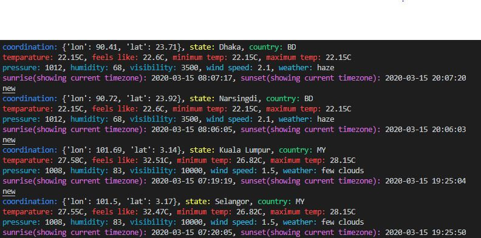

# weather-information
@Author: Abid Ebna Saif Utsha
@Date  : 15/03/2020

This is a small project for weather information extract using openweatherapi

The color class was taken from https://stackoverflow.com/questions/8924173/how-do-i-print-bold-text-in-python
The api used : https://openweathermap.org/api

Please refer to output image below for the final result. The sunrise and sunset timezone are in Malaysia time.

